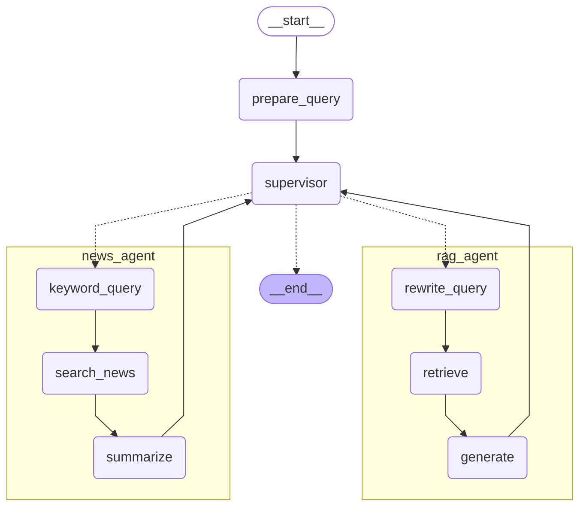
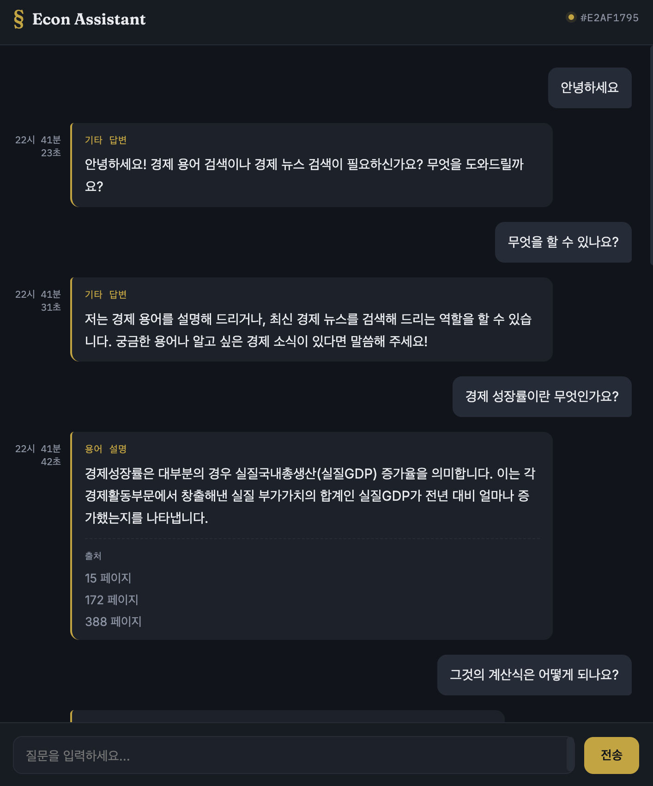
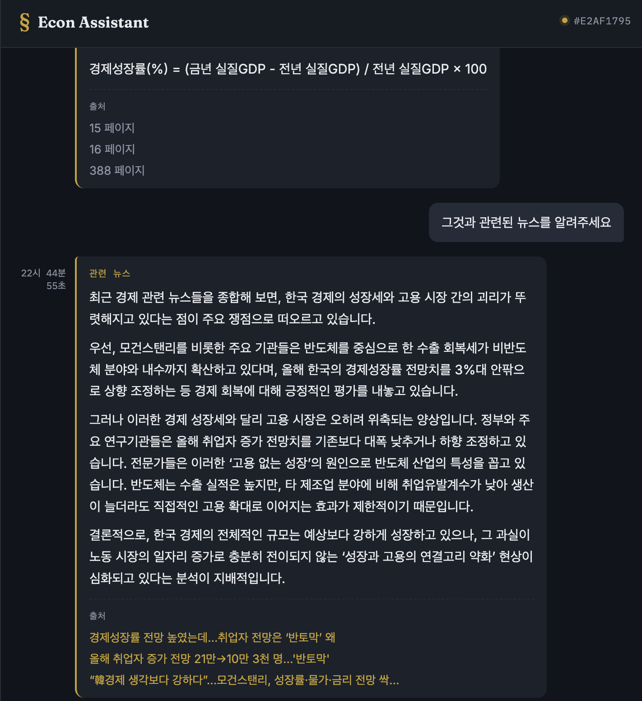
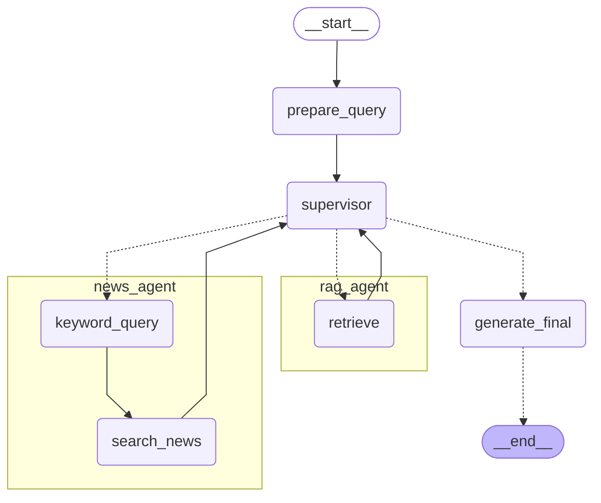

# 💵 Econ Assistant
## 프로젝트 소개
경제 용어는 언제 들어도 낯설고 어렵다. 한국 은행에서 배포한 "2026 경제금융용어 800선" pdf 파일은 누구나 쉽게 받을 수 있기 때문에 이를 이용해 나만의 경제 용어 도우미 챗봇을 만들어 보았다.  

경제 용어 도우미 챗봇을 이용해 할 수 있는 일은 두 가지이다. 첫번째는 경제 금융 용어에 대한 설명을 들을 수 있고, 두번째는 원하는 용어와 관련된 네이버 경제 뉴스를 검색하여 해당 뉴스 링크를 제공받고 기사 원문을 확인할 수 있다.

해당 챗봇은 멀티 에이전트 구조를 사용하여 사용자의 질문에서 용어 검색을 원하는지, 뉴스 검색을 원하는지를 판단하고 이에 따라 알맞은 에이전트를 호출하여 결과를 얻을 수 있도록 하였다. 

## 프로젝트 과정
|ver|목표|달성|
|:---:|---|:---:|
|Ver.1|하나의 그래프인 RAG 시스템|✅|
|Ver.2|RAG 시스템을 하나의 Agent로|✅|
|Ver.3|Multi-Agent : RAG Agent & News Agent|✅|
|Ver.3-1|Multi-Agent : 구조 개선|🔜|
|Ver.4|React pattern 적용하여 Tool을 이용해 검색 정확도 높이기|🔜|

[버젼별 상세 구조 확인](./docs/versions.md)

## 그래프 구조


## 프로젝트 파일 구조
```
chatbot-project/
├── docs/...                    회고 기록
├── src/
│    ├── agents/
│    │   ├── news_agent.py      News Agent
│    │   ├── rag_agent.py       Rag Agent
│    │   └── supervisor.py      Supervisor
│    ├── dataset/
│    │   ├── data_loader.py     Load Documents
│    │   └── vector_store.py    Vector Store, Retriever
│    ├── model.py               Embedding & LLM model
│    ├── multi_agent_graph.py   Multi-Agent Graph
│    ├── settings.py            Settings
│    └── utils.py               Utils
├── static/
│    └── index.html             FE
└──── main.py                   REST API
```
---
## 사용법
### 1.사전 준비물
| 항목 | 용도 |
|---|---|
| [Git](https://git-scm.com/) | 저장소를 내려받기 위해 필요 |
| [uv](https://docs.astral.sh/uv/) | 파이썬 패키지/가상환경 관리 도구 |
| Google API Key | Gemini 모델 사용 시 필요|
| 네이버 개발자 API 키 | 뉴스 검색 기능에 필요|

### 2. 초기 설정
#### 1) 저장소 클론
```bash
git clone https://github.com/sian056/chatbot-project.git

cd chatbot-project  # 프로젝트 폴더 진입
```
#### 2) `.env` 생성 후 설정
1. `.env.example` 템플릿을 복사해서 `.env` 생성
```bash
cp .env.example .env
```

2. `.env` 빈 값 채워서 설정
```
# LLM 선택: google 또는 ollama
SUPERVISOR_PROVIDER=google

RAG_REWRITE_PROVIDER=google
RAG_GENERATE_PROVIDER=google

NEWS_KEYWORD_PROVIDER=google
NEWS_SUMMARIZE_PROVIDER=google

# google 사용 시 모델명
GOOGLE_MODEL=gemini-3.1-flash-lite
# google API KEY (필수)
GOOGLE_API_KEY=발급받은_키

# ollama 사용 시 설정 (gemma4:e2b-mlx 가 ollama로 서빙되어야 함)
OLLAMA_MODEL=gemma4:e2b-mlx
OLLAMA_BASE_URL=http://localhost:11434
#도커에서 실행시
#OLLAMA_BASE_URL=http://host.docker.internal:11434

# Naver 검색 API 설정 (필수)
NAVER_CLIENT_ID=발급받은_ID
NAVER_CLIENT_SECRET=발급받은_시크릿


# Embedding 선택: hugging 또는 google
EMBEDDING_PROVIDER=hugging

# google 사용 시 Embedding 모델 명
GOOGLE_EMBEDDING=models/gemini-embedding-001
# hugging face 사용 시 Embedding 모델 명
HUGGING_EMBEDDING=BAAI/bge-m3
```

### 3. 실행 방법
#### 로컬에서 uv로 실행
```bash
# 필요한 라이브러리 설치
uv sync

# 서버 실행
uv run uvicorn main:app
```
- 서버가 켜지면 브라우저에서 `http://localhost:8000`으로 접속한다.
> **첫 실행 시 참고**  
> 벡터 DB가 아직 없는 상태라면 인덱싱이 자동으로 진행된다. 또한 임베딩 모델을 자동으로 내려받기 때문에 첫 실행 시 다소 시간이 걸릴 수 있다. 이후에는 모델과 인덱스를 재사용하므로 빨라진다.

> ***!주의사항!***  
> 요청이 너무 빠르게 자주 발생하면 gemini rate limit에 걸리게 되므로 질문은 시간 텀을 두고 해야한다.


### 4. 실제 사용 예시
- 브라우저에서 `http://localhost:8000`으로 접속하면 채팅 화면이 뜬다.
- 경제 용어 검색 예시


- 뉴스 검색 예시



## 개선 방향
구조적으로 LLM 호출이 여러 번 일어나는 구조라서 향후 효율적인 구조로 개선하도록 한다.
### 그래프 구조 개선 방향 예시

