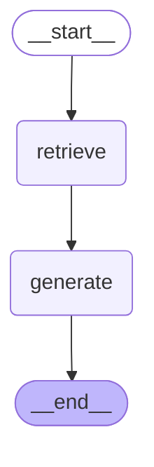
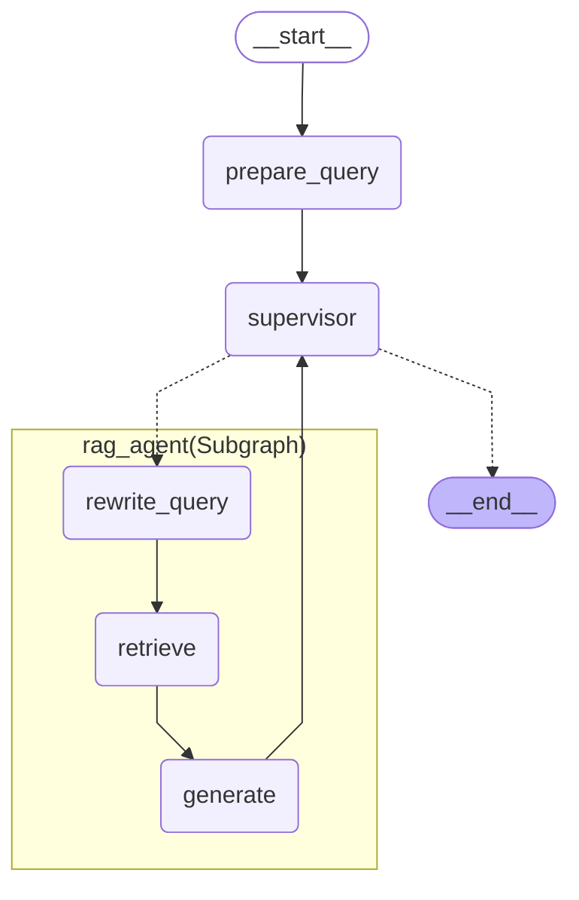
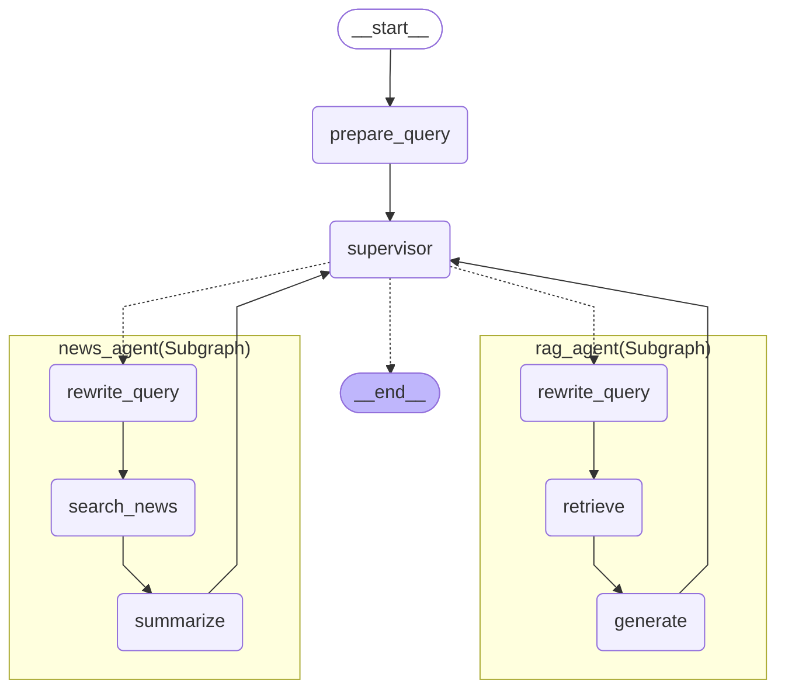
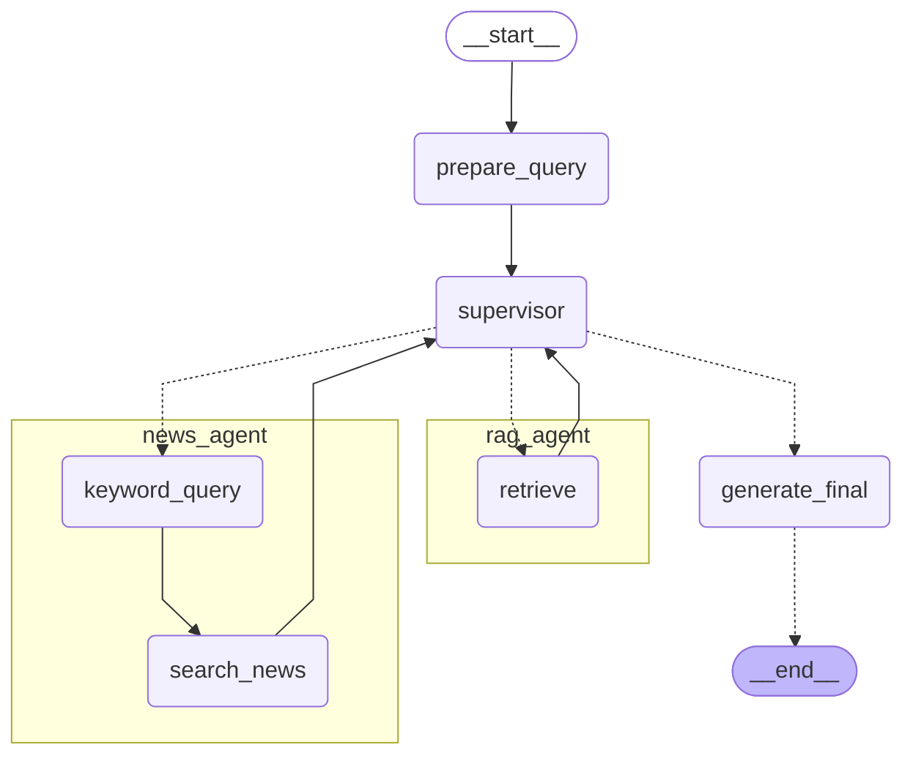

# Versions

## 단계별 구현
|ver|목표|달성|
|:---:|---|:---:|
|Ver.1|하나의 그래프인 RAG 시스템|✅|
|Ver.2|RAG 시스템을 하나의 Agent로|✅|
|Ver.3|Multi-Agent : News Agent 추가|✅|
|Ver.3-1|Multi-Agent : 구조 개선|🔜|
|Ver.4|React pattern 적용하여 Tool을 이용해 검색 정확도 높이기|🔜|

---
### Ver.1 하나의 그래프인 RAG 시스템

---
### Ver.2 Retriever Graph를 하나의 Agent로, Supervisor 추가
`prepare_query` : 전문 agent에서 쿼리를 사용하기 위해 유저의 질문을 저장해두고 넘겨줌.

---
### Ver.3 Multi-Agent : rag agent, news agent

---
### (예정) Ver.3-1 Multi-Agent : rag agent, news agent 구조 개선

#### 고민1
> 검색 정확도 향상을 위해 Retrieve와 리랭킹?

### 어려운 점
수식 로드 &rarr; 금융 계산과 관련 있음

