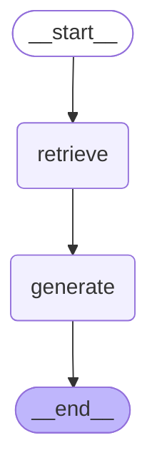
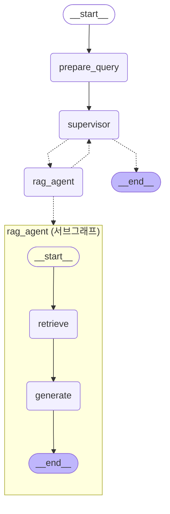
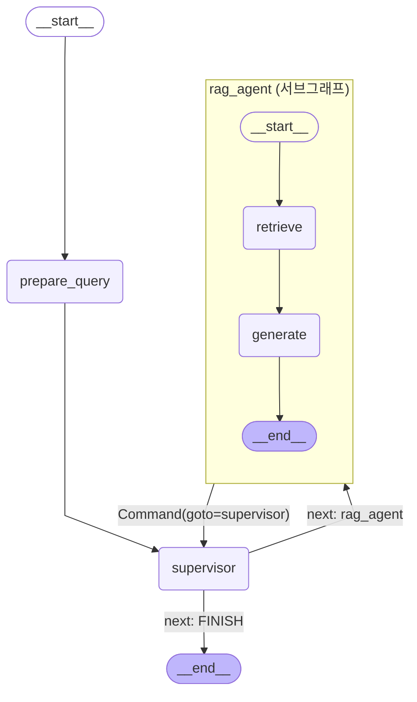
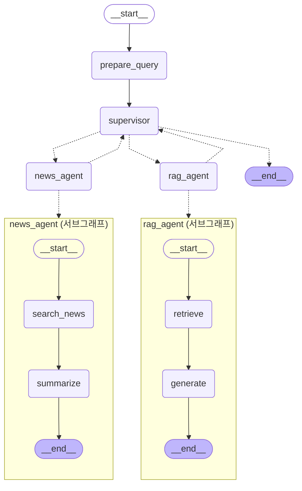
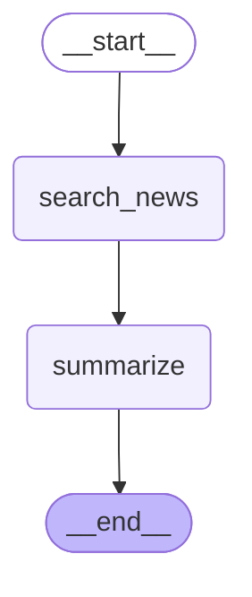

# Versions
## 업데이트 기록
| Updated Date | 내용 |주요 파일명|
|:---:|---|:---:|
|260707|Github에서 `.md` 문서 로더 추가|data_loader.py|
|260708|pdf 파일 로더 추가 |data_loader.py|
|260712|pdf 페이지 전처리, 출처 페이지 표시 추가 |data_loader.py, graph.py|
|260712|초기 인덱싱 분리|vector_store.py|
|260727|supervisor-agent 구조: 2개 agent구성|agents/|

## 로드맵
### 현재의 주제로 할 수 있는 일
-  RAG agent
    - 용어 검색
        - 경제 용어에 대해 물어보면 설명과 더불어 연관 검색어(pdf에 있음)를 얻는다.
        - 역으로 용어에 대한 설명을 던지면 해당되는 용어를 알려준다.
    - 용어 비교
        - 두 가지 용어 비교
- 요약?
- 금융 계산 agent : 금융 특화 기능 ** 수식 미리 정의하지 않으면 어려움
```
"연이율 5%, 원금 1000만원, 3년 복리이면 얼마?"
→ 계산 Agent가 공식 적용해서 계산
```
- 경제 뉴스 검색 agent : 

+@
- 퀴즈 학습 agent : 

```
사용자 질문
    ↓
[Supervisor Agent]  ← 질문을 분석해서 적절한 Agent에 라우팅
    ↓
┌───────────────────────────────────────┐
│  RAG Agent  │  금융 계산 Agent  │  뉴스 Agent  │  ...  │
└───────────────────────────────────────┘
    ↓
최종 답변 생성
```

단순한 기능은 Tool로, 복잡한 기능은 Agent로 
```
Supervisor (Agent Node)
    ├── RAG Agent (Agent Node)     ← 복잡한 검색+답변 생성
    │       └── [retriever_tool, rerank_tool]
    ├── 뉴스 Agent (Agent Node)     ← 검색+분석+요약 복잡한 과정
    │       └── [web_search_tool, summarize_tool]
    ├── calc_tool (Tool Node)      ← 단순 계산
    └── compare_tool (Tool Node)   ← 단순 비교
```

### 단계별 구현
|단계|목표|달성|
|:---:|---|:---:|
|Ver.1|하나의 그래프인 RAG 시스템|✅|
|Ver.2|Retriever Graph 를 React pattern 적용하여 Tool을 이용해 검색 정확도 높이기||
|Ver.3|Retriever Graph를 하나의 Agent로||
|Ver.4|Multi-Agent : Agent 추가||


---
### Ver.1 하나의 그래프인 RAG 시스템

---
### Ver.3 Retriever Graph를 하나의 Agent로, Supervisor 추가
`prepare_query` : 전문 agent에서 쿼리를 사용하기 위해 유저의 질문을 저장해두고 넘겨줌.





---
### Ver.4 Multi-Agent : rag agent, news agent




#### 고민1
> 검색 정확도 향상을 위해 Retrieve와 리랭킹?

### 어려운 점
수식 로드 &rarr; 금융 계산과 관련 있음

